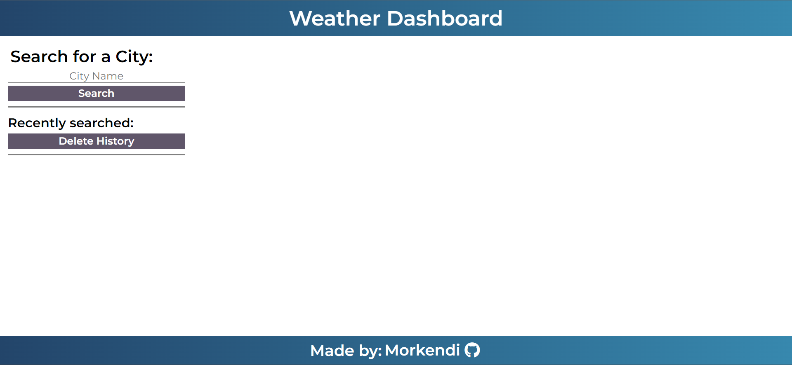
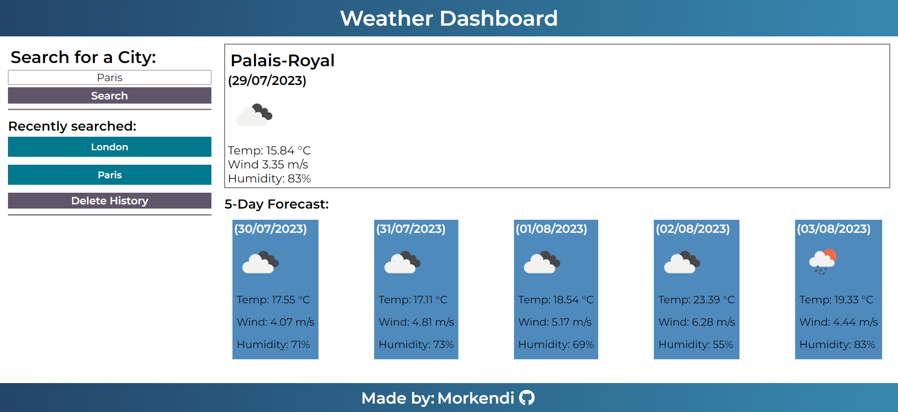
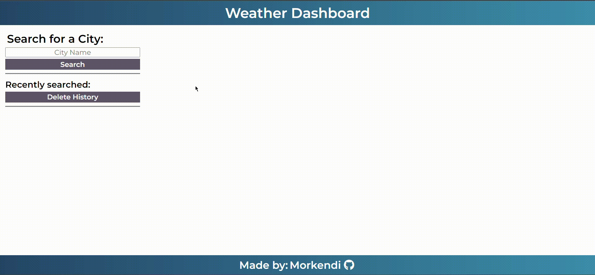

# Weather Dashboard <!-- omit in toc -->

</img>
</img>

## Table of contents <!-- omit in toc -->

- [Description](#description)
- [Usage](#usage)
- [Landing page](#landing-page)
- [Mock Up](#mock-up)
- [License](#license)
- [Credits](#credits)
- [Links](#links)
## Description
When travelling, it is always a good idea to check the weather forecast for the current day, as well as the upcoming days in order to prepare our luggage. This weather dashboard app allows the use to search for a city name and be abel to see the cities' temperature, wind speed and humidity for the current day, as well as a forecast for the next 5 days.

## Usage

## Landing page
The landing page consist of 2 main elements:

- ### **Left column: The left column consists of 2 elements**
    - Search bar: The search bar allows the user to input the name of a city and receive the weather information for said city.
    - Search history (Coming Soon): Allows the use to see previously looked for cities.

- ### **Right column: The right column consists of 2 elements**
    - Current day Forecast: This elements displays the city name and current date, as well as seeing current temperature, wind speed and humidity information
    - 5 day Forecast. This section contains all previously mentioned information, but displayed for the next 5 days

## Mock Up
The following images demonstrate the functionality of the application.

        <h2>Homepage</h2>
    </img>
        <h2>Search Example</h2>
    </img>
        <h2>Functionality Demo</h2>
    </img>

## License
This project utilizes an MIT License. [Read more](https://choosealicense.com/licenses/mit/)

## Credits
- Code by: [Daniel Sanchez](https://github.com/Morkendi)

## Links
- Link to [GitHub Repo](https://github.com/Morkendi/Weather-Dashboard)
- Link to [Deployment](https://morkendi.github.io/Weather-Dashboard/)